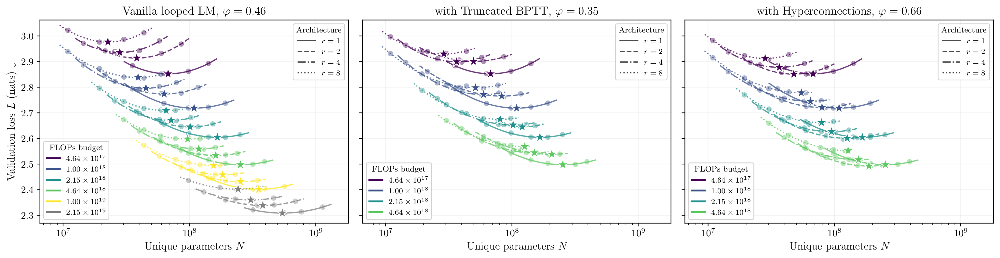

# Iso-Depth Scaling Laws for Looped LMs

[](https://arxiv.org/abs/2604.21106)
[](https://kschwethelm.github.io/looped-lm-scaling/)
[](https://huggingface.co/collections/KristianS7/iso-depth-scaling-laws-for-looped-lms)
[](https://pytorch.org/)
[](LICENSE)

Code for the paper [**How Much Is One Recurrence Worth? Iso-Depth Scaling Laws for Looped Language Models**](https://arxiv.org/abs/2604.21106). We measure the parameter-sharing cost of looped (depth-recurrent) transformers as a single number, the recurrence-equivalence exponent $\varphi$, and obtain $\varphi = 0.46$ from a 116-run iso-depth grid spanning ~50× in training compute. We then use $\Delta\varphi$ as a measurement tool: truncated BPTT makes the loop worse ($\varphi = 0.35$) despite lowering validation loss, while hyperconnections improve it ($\varphi = 0.66$).



## Features

This repository provides the pretraining pipeline for looped language models and the shell scripts that reproduce the paper. The implementation is close to [karpathy/nanochat](https://github.com/karpathy/nanochat), so the SFT and RL stages from upstream port over with minimal changes. Selected model checkpoints from the experiments will be released on the [HuggingFace collection](https://huggingface.co/collections/KristianS7/iso-depth-scaling-laws-for-looped-lms) soon.

The architecture follows the prelude-recur-coda template of [Huginn (Geiping et al., 2025)](https://arxiv.org/abs/2502.05171): a small unshared **prelude** (2 layers), followed by shared **recurrent block** (16/*r* layers, iterated *r* times), followed by an unshared **coda** (2 layers). Depth is fixed to 20 layers in our experiments. Width is parameterised by a single scale factor `s`: `model_dim = 64 · s`, with attention head dimension 128. At `s=20, r=4` the model matches the original nanochat in per-token FLOPs.

Beyond the baseline architecture the repository implements:

- **Multiple input-injection modes** between recurrences: linear concat-injection (Huginn default), additive, passthrough (no injection), and **hyperconnections** with N parallel residual lanes ([Zhu et al., 2025](https://openreview.net/forum?id=9FqARW7dwB)).
- **Truncated BPTT** through the recurrence dimension (`bptt_k`): gradients flow only through the last `k` recurrences, saving training compute for the early loops.
- **KV-cache budget for recurrences at inference** (`kv_budget`): storing KV entries from only the last *k* of *r* recurrences.
- **FP8 training** on H100+ via tensorwise scaling.
- **Automatic FlashAttention selection**: FA3 on Hopper+, FA2 on Ampere/Ada, PyTorch SDPA fallback elsewhere.
- **MuonH optimiser** with the [HyperP](https://arxiv.org/abs/2603.28743) hyperparameter-transfer recipe (width-and-depth LR transfer, weight decay as a no-op on the Frobenius sphere). Verified empirically.

See the [paper](https://arxiv.org/abs/2604.21106) for details.

## Quick Start

```bash
# 1. Set up cluster config
cp shells/_machine_config.sh.template shells/_machine_config.sh
# Edit with your cluster settings (partition, QoS, GPUs, etc.)

# 2. Download pre-packed FineWeb-Edu dataset from HuggingFace
./shells/_submit.sh shells/preprocessing/download_prepacked_cpu.sh

# 3. Train (uses pre-packed data for simplicity and reproducibility)
./shells/_submit.sh shells/base_train.sh
```

To build the pre-packed dataset from scratch instead of downloading:
```bash
./shells/_submit.sh shells/preprocessing/prepack_cpu.sh
```

## SLURM Job Submission

All jobs are submitted through a single wrapper that reads cluster config from `shells/_machine_config.sh`:

```bash
# Submit any job
./shells/_submit.sh shells/<script>.sh

# Pass script arguments before --, sbatch overrides after --
./shells/_submit.sh shells/base_train.sh --smoke-test -- --time=24:00:00

# Array jobs (e.g. hyperparameter sweeps)
LOOPED=true ./shells/_submit.sh shells/ablations/sweep_lr.sh -- --array=0-7
```

Scripts ending with `_cpu.sh` are automatically routed to the CPU partition; all others go to GPU. Logs go to `logs/<script_name>/`.

## Reproducing the paper

The shell scripts under `shells/` map to the experiments in the paper:

- [`scaling_laws/scaling_laws.sh`](shells/scaling_laws/scaling_laws.sh): the 116-run iso-depth grid across `r ∈ {1, 2, 4, 8}` and six compute budgets.
- [`scaling_laws/scaling_laws_truncbptt.sh`](shells/scaling_laws/scaling_laws_truncbptt.sh): the truncated-BPTT probe (Section 5.1).
- [`scaling_laws/scaling_laws_hyperconnect.sh`](shells/scaling_laws/scaling_laws_hyperconnect.sh): the hyperconnections probe (Section 5.2).
- [`ablations/sweep_lr.sh`](shells/ablations/sweep_lr.sh): the learning-rate sweep used to set the MuonH LR per architecture.
- [`ablations/injection_ablation.sh`](shells/ablations/injection_ablation.sh): linear vs. additive vs. passthrough injection at the reference configuration.
- [`flagship_train/flagship.sh`](shells/flagship_train/flagship.sh): the `s=34` extrapolation run.

## Evaluation

Downstream evaluation runs in two steps. First, build the evaluation bundles once:

```bash
python dev/eval_bundles/owned/prepare_owned_bundle.py
python dev/eval_bundles/saunshi/prepare_saunshi_bundle.py
```

Then evaluate any base checkpoint with:

```bash
./shells/_submit.sh shells/base_eval.sh
```

`base_eval.py` computes our five-axis owned bundle (parametric knowledge, reading comprehension, math word problems, reasoning primitives, compositional symbolic), the Saunshi reasoning suite, and/or the CORE score.

## Cite

If you find our code helpful, please cite our paper:

```bibtex
@misc{schwethelm2026isodepthscaling,
      title={How Much Is One Recurrence Worth? Iso-Depth Scaling Laws for Looped Language Models},
      author={Kristian Schwethelm and Daniel Rueckert and Georgios Kaissis},
      year={2026},
      eprint={2604.21106},
      archivePrefix={arXiv},
      primaryClass={cs.LG},
      url={https://arxiv.org/abs/2604.21106},
}
```

This project is based on [karpathy/nanochat](https://github.com/karpathy/nanochat). Please also cite the original:

```bibtex
@misc{nanochat,
  author = {Andrej Karpathy},
  title = {nanochat: The best ChatGPT that $100 can buy},
  year = {2025},
  publisher = {GitHub},
  url = {https://github.com/karpathy/nanochat}
}
```

